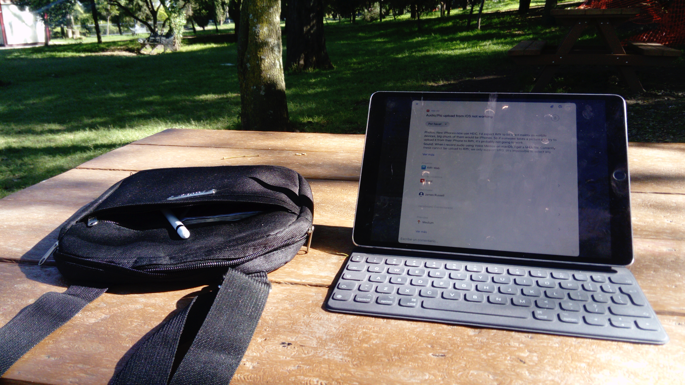
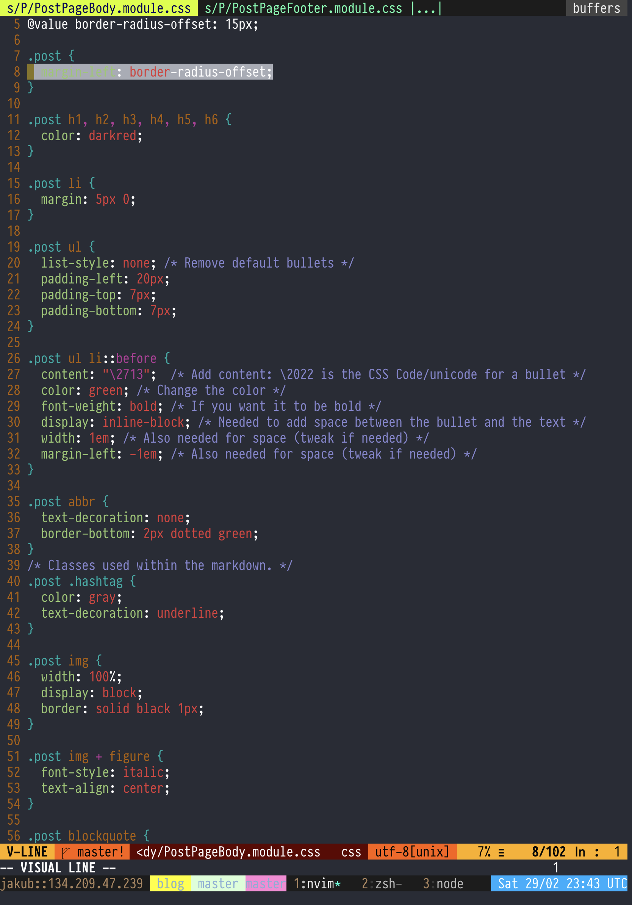
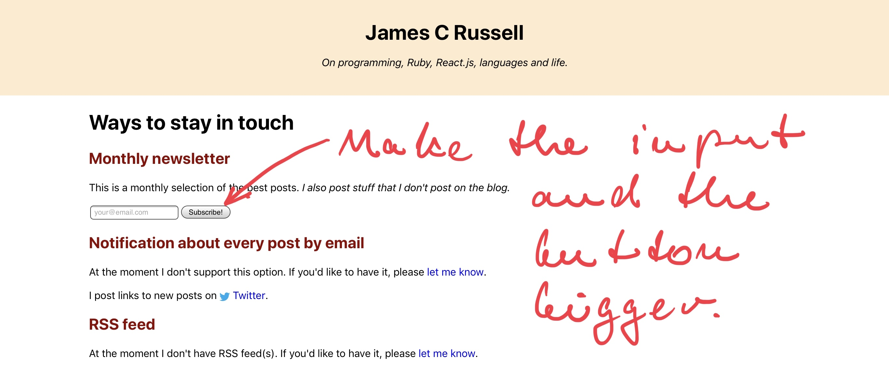
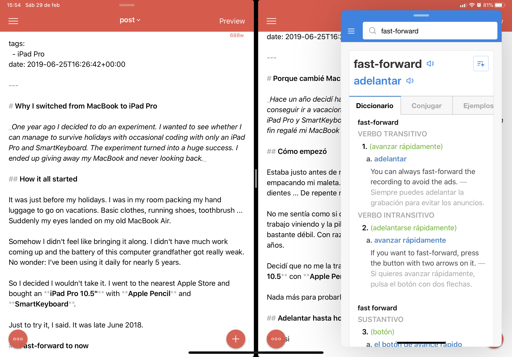

lang: es
tags:
  - iPad Pro
date: 2019-06-25T16:26:42+00:00

---

# Porque cambié MacBook por iPad Pro

_Hace un año decidí hacer un experiment. Quería ver si podría conseguir ir a vacaciones y programar cada rato usando nada más el iPad Pro y SmartKeyboard. El experimento resultó muy exitosamente. En fin regalé mi MacBook y cambié a iPad Pro de tiempo completo._

## Cómo empezó

Estaba justo antes de mis vacaciones. Estaba en mi recámara empacando mi maleta. Ropa básica, zapatos para correr, cepillo de dientes ... De repente me di cuenta mi viejo MacBook Air.

No me sentía como si que lo quiera traer conmigo. No tenía tanto trabajo viniendo y la pila de esta abuela de computadora ya era bastante débil. Con razón: estaba usándola todos los días por casi 5 años.

Decidí que no me la traigo. Fui a un Apple Store y compré un **iPad Pro 10.5** con **Apple Pencil** y **SmartKeyboard**.

Nada más para probarlo dije. Era junio 2018.

## Adelantar hasta hoy

Ya casi es un año desde cuando me compré mi iPad. Desde entonces regalé mi viejo MacBook Air y estaba trabajando exclusivamente en mi iPad Pro y no miro atrás.

Desde entonces compré **iPad Pro 12.9"** para mi trabajo: resultó que probar aplicaciones de web en una pantalla de 10.5 pulgadas no es viable.

## Ventajas

### LTE

A veces trabajo de un parque. Cuando me canse, miro las ardillas, camino un poco y después sigo trabajando.

Muchas veces tomo mi iPad conmigo y trabajo en lugares donde no me molestaría traer una compu.

Tampoco tengo que esperar para preguntar que clave usa la red o probar a leer e ingresar una clave de 32 carácteres, si trabaja de una cafetería.

Y finalmente ... cuando la red vale madres, como vale muchas veces, LTE salva el día.

### No ventilador ruidoso, muslos quemados o despierto lento

Llámame mimado si quieren, pero me cagan los ventiladores, computadora caliente y el tiempo que se necesita para despertar la pinche cosa.

Con un iPad, nada de esto es un problema. Por la mayoría de tiempo la cosa se queda fría. No tiene ventiladores y está lista para acción en cualquier momento (no como yo en la mañana).

### La pila

La pila dura todo el día sin problema. Para mi esto es muy importante.

### Face ID

Desde cuando compré el nuevo iPad Pro 12.9", amo Face ID. Siempre funciona sin problema.

La cosa sobre Touch ID es que funciona _bastante bien_ en un clima frío o templado. En un clima caliente, cuando tus manos sudan bastante, no es muy práctico.

Y como vivo en un país bastante caluroso, esto siempre era un problema para mi. Estoy muy contento con la actualización, ¡vale la pena sin duda!

### Flexibilidad

La neta aprecio que la pantalla no está fija a ninguna base, como una con un teclado.

Esto facilita armar setups flexibles, como un escritorio de pie, puedes tener el iPad en la altura de tus ojos y el teclado bluetooth donde esté cómodo.

Con un estand rotatorio se puede girar la pantalla entre el modo retrato y panorama.

Esto es bien importante: si necesitas trabajar con mucho texto que no sea muy ancho, es muy conveniente girar la pantalla y hacerlo en el modo de retrato, donde puede caber más.

Y finalmente si quiero trabajar de una cafetería por un rato, nada más sujeto el SmartKeyboard y ¡listo!

### Anotación de las capturas de pantalla

En el desarrollo de las aplicaciones de web, muchos errores de programación se manifiestan en una forma visible.

No hay nada más fácil que sacar una captura de pantalla y anotarla con el Apple Pencil y después nada más subirla a un _bug tracking system_ del cliente.

### El split-screen

La idea de las ventanas superpuestas en un sistema operativo me parece hinchada, irritanta e innecesaria.

Lo que iOS introdujo no es nada nuevo: los _tile window managers_ en Linux ya lo tienen por un buen rato. Pero es algo que funciona y tiene sentido.

¡Y ya! En la próxima entrada voy a hablar sobres mis flujos de trabajo en programación en un iPad Pro.