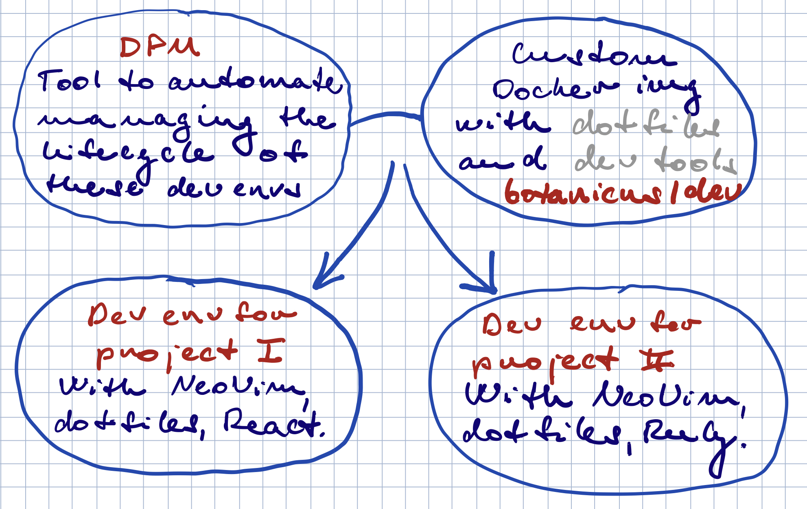
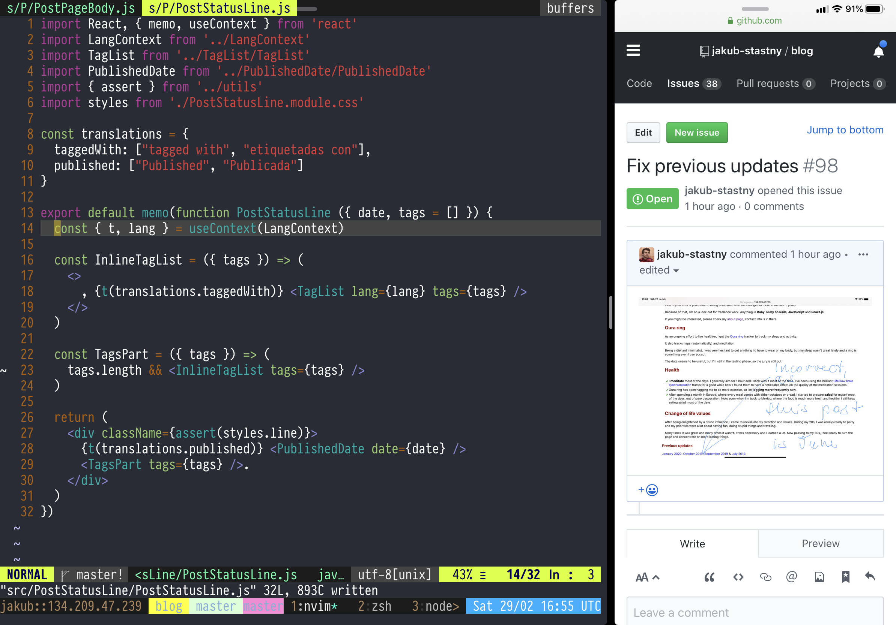

lang: es
tags:
  - iPad Pro
date: 2019-06-25T16:26:42+00:00

---

# Porque cambié MacBook por iPad Pro

_Hace un año decidí hacer un experiment. Quería ver si podría conseguir ir a vacaciones y programar cada rato usando nada más el iPad Pro y SmartKeyboard. El experimento resultó muy exitosamente. En fin regalé mi MacBook y cambié a iPad Pro de tiempo completo._

## Cómo empezó

Estaba justo antes de mis vacaciones. Estaba en mi recámara empacando mi maleta. Ropa básica, zapatos para correr, cepillo de dientes ... De repente me di cuenta mi viejo MacBook Air.

No me sentía como si que lo quiera traer conmigo. No tenía tanto trabajo viniendo y la pila de esta abuela de computadora ya era bastante débil. Con razón: estaba usándola todos los días por casi 5 años.

Decidí que no me la traigo. Fui a un Apple Store y compré un **iPad Pro 10.5** con **Apple Pencil** y **SmartKeyboard**.

Nada más para probarlo dije. Era junio 2018.

## Adelantar hasta hoy

Ya casi es un año desde cuando me compré mi iPad. Desde entonces regalé mi viejo MacBook Air y estaba trabajando exclusivamente en mi iPad Pro y no miro atrás.

Desde entonces compré **iPad Pro 12.9"** para mi trabajo: resultó que probar aplicaciones de web en una pantalla de 10.5 pulgadas no es viable.

## Ventajas

### LTE

A veces trabajo de un parque. Cuando me canse, miro las ardillas, camino un poco y después sigo trabajando.

Muchas veces tomo mi iPad conmigo y trabajo en lugares donde no me molestaría traer una compu.

Tampoco tengo que esperar para preguntar que clave usa la red o probar a leer e ingresar una clave de 32 carácteres, si trabaja de una cafetería.

Y finalmente ... cuando la red vale madres, como vale muchas veces, LTE salva el día.

### No ventilador ruidoso, muslos quemados o despierto lento

Llámame mimado si quieren, pero me cagan los ventiladores, computadora caliente y el tiempo que se necesita para despertar la pinche cosa.

Con un iPad, nada de esto es un problema. Por la mayoría de tiempo la cosa se queda fría. No tiene ventiladores y está lista para acción en cualquier momento (no como yo en la mañana).

### La pila

La pila dura todo el día sin problema. Para mi esto es muy importante.

### Face ID

Desde cuando compré el nuevo iPad Pro 12.9", amo Face ID. Siempre funciona sin problema.

La cosa sobre Touch ID es que funciona _bastante bien_ en un clima frío o templado. En un clima caliente, cuando tus manos sudan bastante, no es muy práctico.

Y como vivo en un país bastante caluroso, esto siempre era un problema para mi. Estoy muy contento con la actualización, ¡vale la pena sin duda!

Más allá de que práctico es, Face ID es mucho más seguro, especially comparando con protección con contraseña. Desbloquear la app de tu banco con tu cara es mucho más fácil y much más seguro. Claro, todavía tendrás tu contraseña también, pero como casi no la usas, la probabilidad para alguien para aprenderla es mínima.

### Flexibilidad

La neta aprecio que la pantalla no está fija a ninguna base, como una con un teclado.

Esto facilita armar setups flexibles, como un escritorio de pie, puedes tener el iPad en la altura de tus ojos y el teclado bluetooth donde esté cómodo.

Con un estand rotatorio se puede girar la pantalla entre el modo retrato y panorama.

Esto es bien importante: si necesitas trabajar con mucho texto que no sea muy ancho, es muy conveniente girar la pantalla y hacerlo en el modo de retrato, donde puede caber más.

Y finalmente si quiero trabajar de una cafetería por un rato, nada más sujeto el SmartKeyboard y ¡listo!

### Apple Pencil

#### Anotación de las capturas de pantalla

En el desarrollo de las aplicaciones de web, muchos errores de programación se manifiestan en una forma visible.

No hay nada más fácil que sacar una captura de pantalla y anotarla con el Apple Pencil y después nada más subirla a un _bug tracking system_ del cliente.

#### Dibujar diagramas

#### Escribir notas personales con dibujos

Por mucho tiempo escribía cartas bastante. Estos días a menudo hago una nota con Apple Pencil, a veces con un dibujito para expresar una idea y lo mando por correo electrónico o Telegram.

De hecho empecé [etiqueta ensayo](/etiquetas/ensayo) y todos los ensayos son escritos por mano con el Apple Pencil.

### El split-screen

La idea de las ventanas superpuestas en un sistema operativo me parece hinchada, irritanta e innecesaria.

Lo que iOS introdujo no es nada nuevo: los _tile window managers_ en Linux ya lo tienen por un buen rato. Pero es algo que funciona y tiene sentido.

### Cámara y apps escáner

Tanto como el iPad no es el dispositivo perfecto para la fotografía, a veces lo uso. Sobre todo para escanear documentos con el [Scanner Pro][scanner-pro-app], donde me parece hasta bastante práctico.

### Copia de seguridad de iCloud

Las copias de seguridad en los sistemas operativos de escritorio siempre son complicadas. Los sistemas tienen mucha flexibilidad y entonces es difícil saber que son todas las cosas que tienes que copiar.

iOS no tiene la misma flexibilidad y esto hace las copias de seguridad súper fácil. Además Apple te da 5GB del espacio de iCloud gratis, así que ni aún tienes que gastar ni un peso.

## Desventajas

### Escripting

Los atajos son muy poderosos, pero para mi es mucho más fácil escribir un escript en Ruby. Sé Ruby, llevo más que 12 años usándolo, el API no va a cambiar considerablemente y puedo versionar el código en un depózito de GitHub.

No estoy acostumbrado a esta madre de programación visual. Me gusta que es fácil usar aquellos de los componentes UI, pero ... para mi no es tan fácil usarlo, las etiquetas de acciones van a cambiar y no puedo versionar el código en un depózito de GitHub.

Claro, puedo escribir en escript de Ruby y ejecutarlo en mi VPS. Esto va a funcionar muchas veces, especialmente porque tengo todos mis archivos en Dropbox, así que el VPS puede accederlos. Pero esto no funciona siempre. Tenía un escript para jugar un mp3 de meditacción al azar. Ejecutar este escript en un VPS no va a funcionar, porque es yo quien quiere meditar en _mi máquina_, no en el centro de datos.

Sin embargo en otros casos veo este cambio en una luz positiva. No es nada especifical al iPad, pero tener un worker o un trabajo de cron en un VPS y trabajar con archivos en la nube es mucho mejor que tener un escript local trabajando con un FS local.

## Falta de aplicaciones maduros ocasional

No siempre, pero muchas veces las aplicaciones disponibles no son tan maduras. Por ejemplo no en el escritorio no es tan difícil encontrar un editor de texto para los archivos markdown.

En iOS eso no es tan fácil. Personalmente uso 1Writer y me gusta, porque sabe sincronizar con Dropbox sin ningún problema, pero seguramente podría resaltar la sintaxis de markdown mejor.

También tuve problemas con la edición de gráfica. Admito que no tengo mucha idea del asunto, pues quizá nada más soy yo, pero probé crear un esticker de Telegram, pasé un buen rato probándolo y en fin me rendí.

¡Y ya! En la próxima entrada voy a hablar sobres [mis flujos de trabajo en programación en un iPad Pro](/entradas/programacion-en-ipad-pro).

[scanner-pro-app]: https://readdle.com/scannerpro