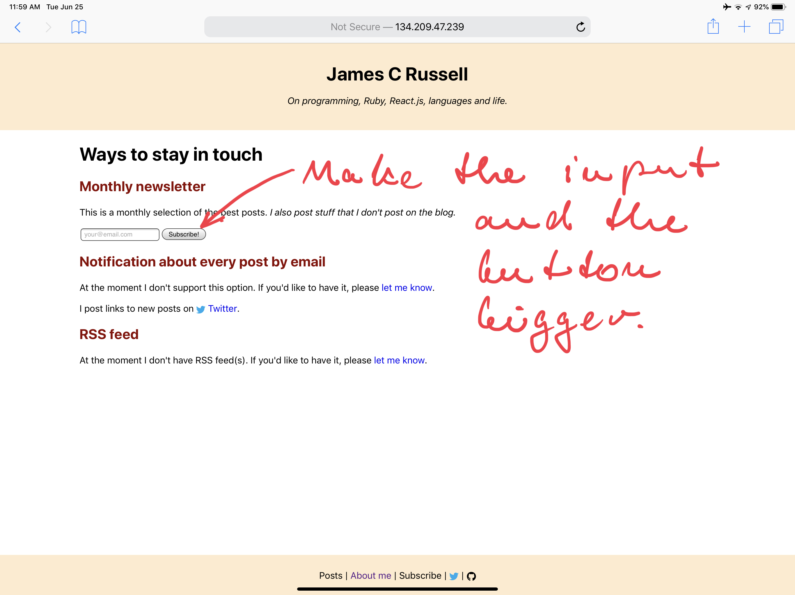

tags:
  - iPad Pro
date: 2019-06-25T16:26:42.848Z

---

# Programming on iPad Pro full-time

_One year ago I decided to do an experiment. I wanted to see whether I can manage to survive holidays with occasional coding with only an iPad Pro and SmartKeyboard. The experiment turned into a huge success. I ended up giving away my MacBook and never looking back._

## How it all started

It was just before my holidays. I was in my room packing my hand luggage to go on vacations. Basic clothes, running shoes, toothbrush ... Suddenly my eyes landed on my old MacBook Air.

Somehow I didn't feel like bringing it along. I didn't have much work coming up and the battery of this computer grandfather got really weak. No wonder: I've been using it daily for nearly 5 years.

So I decided I wouldn't take it. I went to the nearest Apple Store and bought an <i class="hashtag">iPad Pro 10.5"</i> with <i class="hashtag">Apple Pencil</i> and <i class="hashtag">SmartKeyboard</i>.

Just to try it, I said. It was late June 2018.

## Fast-forward to now

It's going to be one year soon. Since then, I got rid off my old MacBook Air and I've been developing exclusively on an iPad Pro and I don't look back.

I upgraded since then to <i class="hashtag">iPad Pro 12.9"</i>, since it turned out testing web apps on 10.5" screen is simply not viable, but I'm still on an iPad Pro.

## Advantages

### LTE

At times I go and work from the park. I watch the squirrels when I'm tired, walk a bit and the go on working.

I sometimes take the iPad out and work in places where I otherwise wouldn't bother.

I don't need to wait for a lazy waitress to bring me a note with barely readable 32 character long weird WiFi password.

And finally ... if the WiFi sucks, as it often does, LTE saves the day.

### Screenshot annotation

Being a web developer, vast majority of bugs manifests itself in a visible form.

There's nothing easier than taking a screenshot and annotating it with the Apple Pencil and then just uploading it into client's bug tracking system.

### No noisy fans, burned things and no slow waking up

Call me spoiled if you will, but I just hate fans, burning hot notebook and the time it takes to wake up the whole damn thing.

With iPad, none of it is a problem. Most of the time the thing is actually cool. It has no fans and it's ready for action at any time.

Given how long it takes me to be able to do anything in the morning, I found this to be next to a miracle.

### Battery life

### FaceID

### Flexibility

Rotating the screen, having it in the right position.
Home setup vs. work from a café setup.

### Split-screen

I found the idea of overlapping windows bloated, annoying and unnecessary.

What iOS came up with is not exactly new: tile window managers on Linux have been doing it for a while. But it's an approach that works and makes sense.

## My Workflow

### Blink, Mosh, DigitalOcean & Docker-project-manager

Docker-project-manager

### Remotix, mouse, RDP & remote Windows in Azure

	"Hey man, the app is ready! It works great on mobile Safari on my iPad!"

It's crystal clear that as a professional web developer, I have to test on desktop browsers as well. Therefore, having access to a desktop OS is imperative.

And there's another thing: doing JS development without Chrome development tools is quite impossible.

Azure is the only service I pay for that I didn't pay for before. And it's costly: to have a decently fast Windows machine, I pay XXX monthly.

But ... I don't have to carry a notebook around. No one can steal it, and I will never need to buy a "new version": the cost of HW upgrades is not on me.

You might have noticed that the title talks about iPad Pro 12.9", while I said I bought iPad Pro 10.5".

As much as prefer the smaller one, testing a web app in such a small resolution simply is not an option. It's just too small. So I got the large iPad Pro and I use the small one as my personal device.
