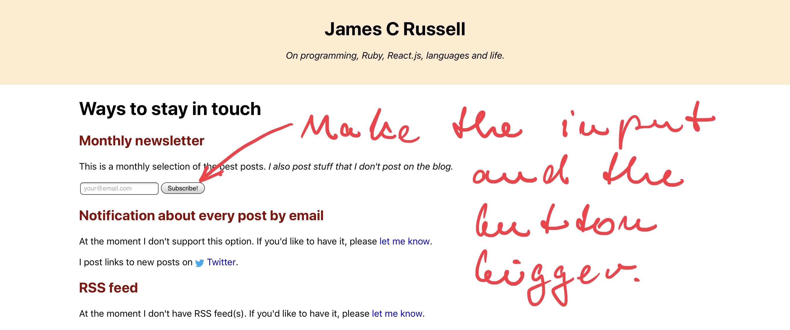

tags:
  - iPad Pro
date: 2019-06-25T16:26:42+00:00

---

# Why I switched from MacBook to iPad Pro

_One year ago I decided to do an experiment. I wanted to see whether I can manage to survive holidays with occasional coding with only an iPad Pro and SmartKeyboard. The experiment turned into a huge success. I ended up giving away my MacBook and never looking back._

## How it all started

It was just before my holidays. I was in my room packing my hand luggage to go on vacations. Basic clothes, running shoes, toothbrush ... Suddenly my eyes landed on my old MacBook Air.

Somehow I didn't feel like bringing it along. I didn't have much work coming up and the battery of this computer grandfather got really weak. No wonder: I've been using it daily for nearly 5 years.

So I decided I wouldn't take it. I went to the nearest Apple Store and bought an **iPad Pro 10.5"** with **Apple Pencil** and **SmartKeyboard**.

Just to try it, I said. It was late June 2018.

## Fast-forward to now

It's going to be one year soon. Since then I got rid off my old MacBook Air and I've been developing exclusively on an iPad Pro and I don't look back.

Since then I got **iPad Pro 12.9"** for my work, since it turned out testing web apps on 10.5" screen is simply not viable, but I'm still on an iPad Pro.

## Advantages

### LTE

At times I go and work from the park. I watch the squirrels when I'm tired, walk a bit and then go on working.

I oftentimes take the iPad out with me and work in places where I wouldn't bother to bring a notebook.

Neither do I have to wait to ask what the WiFi password is and then try to read and enter a barely readable 32 character long password, when I'm working from a café.

And finally ... if the WiFi sucks, as it often does, LTE saves the day.

### No noisy fans, burned thighs and no slow waking up

Call me spoiled if you will, but I just hate fans, burning hot notebook and the time it takes to wake the whole damn thing up.

With an iPad, none of it is a problem. Most of the time the thing actually stays cool. It has no fans and it's ready for action any time (unlike me in the morning).

### Battery life

iPad Pro gets me through the whole day without any problems. For me this is an important factor.

### Face ID

Ever since I upgraded to the new iPad Pro 12.9", I have to say I love Face ID. It just works.

The thing is Touch ID works _quite OK_ in cold or mild climate. In the hot climate, when your palms sweat, it's just not a very practical solution.

And since I do live in a rather hot country, this was an issue for me. So I'm glad I upgraded, Face ID is definitely worth it.

Beyond how practical it is, Face ID is also much safer, especially compared to password protection. Unlocking your internet banking app with your face is much more pleasant and much more safe. Sure, you still do have your password to it, but since you're hardly ever using it, the chance that someone will pick it up is further reduced.

### Flexibility

I really appreciate that the screen is not fixed to any base, such as one with a keyboard.

It makes it easy to do more flexible setups. Such as standing desk, you have your iPad in the height of your eyes, and a BT keyboard wherever it's comfortable.

If you get the right stand, you can rotate the screen between the portrait and landscape mode when necessary.

This is a big deal on such a small screen: if you need to work with a lot of text that's not too wide, it's very convenient to be able to rotate the screen and do it in the portrait mode, where it fits much more text.

And finally if you just want to take it into a café, all you need to do is to attach the SmartKeyboard and you're good to go.

### Apple Pencil

#### Screenshot annotation

In the web development vast majority of bugs manifests itself in a visible form.

There's nothing easier than taking a screenshot and annotating it with the Apple Pencil and then just uploading it into client's bug tracking system.

#### Drawing diagrams

#### Writing personal notes with drawings

I used to write letters quite a bit. These days I often write a note with Apple Pencil, sometimes add a drawing to convey the message and send it through email or Telegram.

As a matter of fact I started [tag essay](/tags/essay) and all the essays are hand-written with Apple Pencil.

### Split-screen

I found the idea of overlapping windows bloated, annoying and unnecessary.

What iOS came up with is not exactly new: tile window managers on Linux have been doing it for a while. But it's an approach that works and makes sense.

### Camera & scanner apps

As much as iPad is not the perfect device for photography, I do use it at times. Especially for scanning documents, with the [Scanner Pro app][scanner-pro-app], where it's not even as clumsy, I actually found it quite practical.

### iCloud back-up & restore

Back-ups on desktop operation systems are tricky. There's so much flexibility in the system that you have no idea what are all the things that you need to back up in the first place.

iOS doesn't have that flexibility and that's what makes backing up really easy. And since Apple gives you 5GB of free iCloud space, you don't even need to spend a penny.

## Disadvantages

### Scripting

Shortcuts are really powerful, but for me it's much easier to write a Ruby script. I know Ruby, I've been using it for over 12 years, I know the API won't change significantly and I can version it in a GitHub repository.

I'm not used to this visual programming thing. I like that it's easy to use some of the UI components, but ... for me it's not as easy to use, the labels surely will change and I cannot version it meaningfully in a GitHub repository.

Sure, I can write a Ruby script and put it on my VPS. This will work many times, especially as I keep all my files in Dropbox, so the VPS can access them. However it won't help always. I used to have a script that'd play random meditation mp3. Running it on a VPS won't help me, as I'm trying to play the mp3 on _my machine_, not in the datacentre.

Speaking of the scripting that you _can_ do on a VPS, I see it as a positive change. It's nothing iPad specific, but having a worker or a cron job on a VPS and work over cloud files is just a much better way of handling things than having a local script working over a local FS.

### Occasional lack of mature apps

Not always, but at times the available apps are not very mature. For instance on desktop it's pretty easy to find a good text editor for markdown files editing.

On iOS this is not that straightforward. I use 1Writer and I'm really happy with it, as it syncs with Dropbox seaminglessly, but a lot could be improved about the markdown syntax highlighting and editing.

I also had issues with graphic editing. I'm really clueless on the subject, so maybe it was just me, but I tried to create a Telegram sticker, spent a good while on it and ultimately I gave up.

And that's it for now! In a follow-up post I'm going to talk about [my programming workflows on iPad Pro](/posts/programming-on-ipad-pro).

[scanner-pro-app]: https://readdle.com/scannerpro