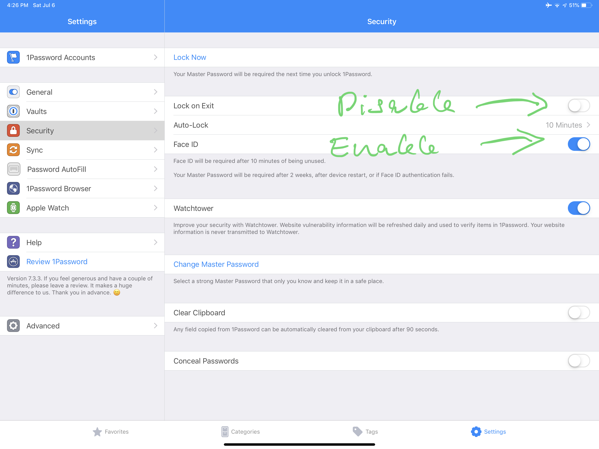
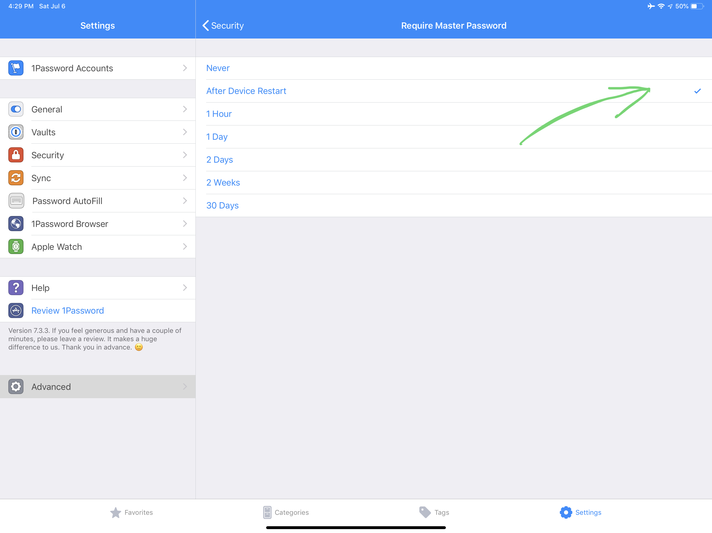
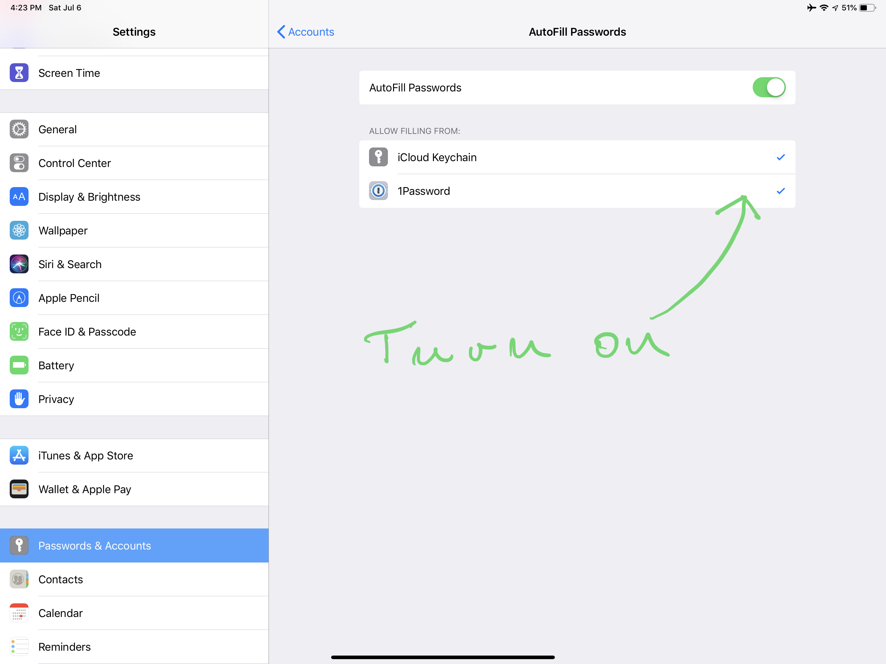
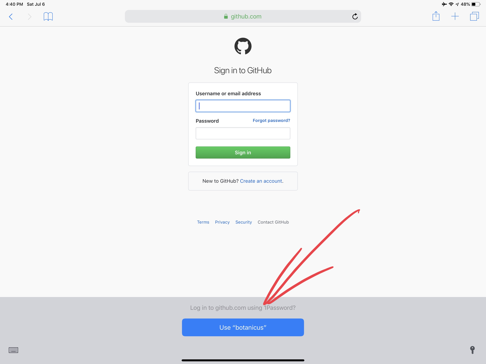
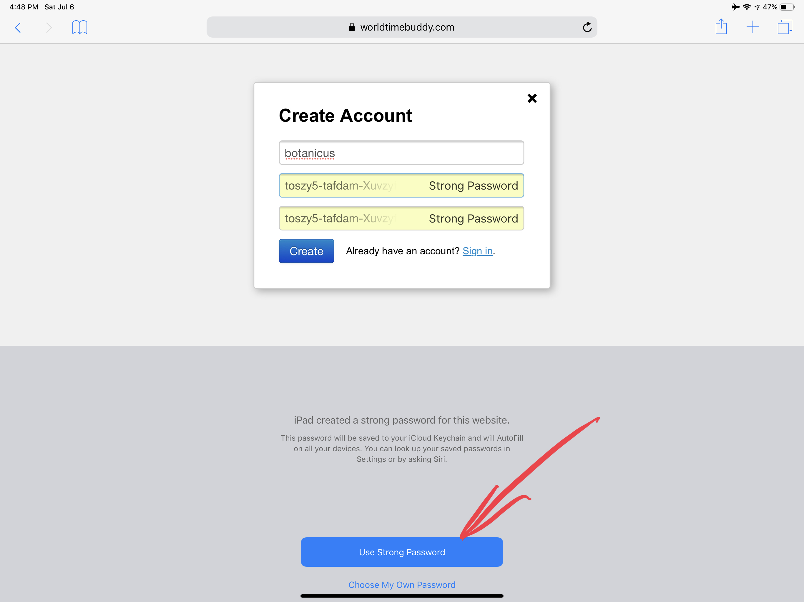
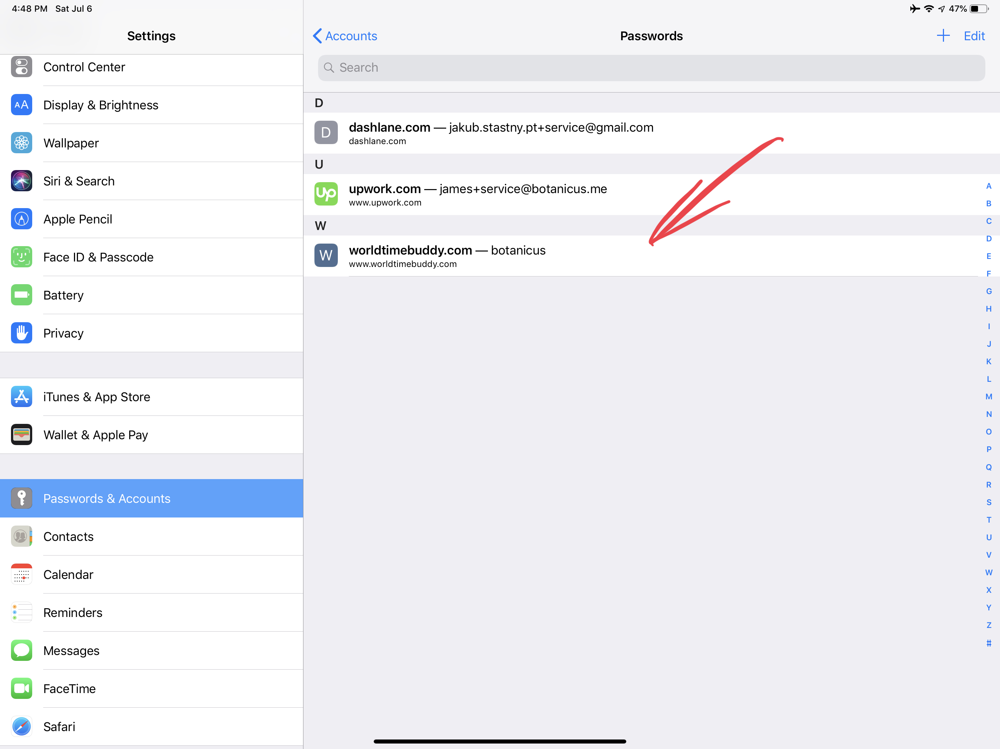
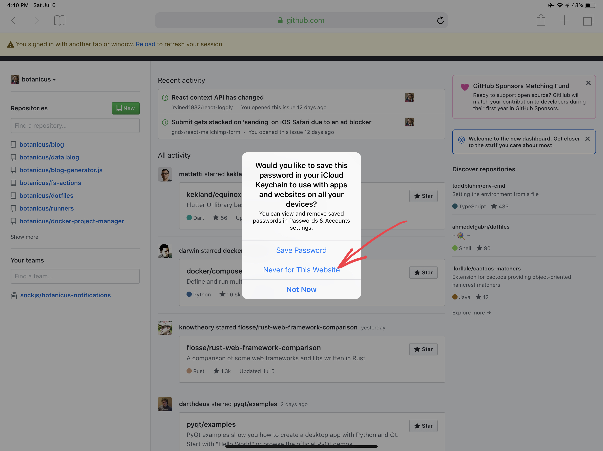

tags:
- iPad Pro
- manejo de contraseñas
- 1Password
date: 2019-07-06 22:42:33.229122078 +00:00

---

# Mi flujo de trabajo con 1Password en iOS

_1Password is one of the programs I've been using the longest. Switching to iOS, the workflow got a bit trickier than it was on macOS with the Chrome plugin AgileBits provides. Fortunately iOS 12 comes with better integration of password managers._

## Why a password manager

Firstly, you might not necessarily need a password manager. If all you have are Apple devices using 1 Apple ID, you can just get by with iOS / macOS integrated password manager.

I have an Android phone and I have 2 iPads each using a different Apple ID, so I have no choice.

## 1Password

1Password was the first popular password manager out there and in my opinion it's still the best option out there, at least if you don't want to pay monthly subscription.

I tried LastPass and DashLane for iOS and I wasn't particularly pleased with either.

I could get used to DashLane, but after the trial subscription runs out, even the most basic functions like synchronization stop working.

What I like about 1Password is that it synchronizes data with your **Dropbox**.

It can even synchronize with **multiple Dropbox vaults**.

## Useful settings

Enable FaceID unlock, disable lock on exit, so 1Password doesn't get locked if you're just switching between apps. 1Password will get locked after a time out.

Don't ask for vault password every two weeks.

## Safari integration

First, you need to enable 1Password Safari integration in _Settings > Passwords & Accounts > Autofill Passwords_.

¡Y ya!

## What's missing

The one thing that iOS currently doesn't support is to save a new password to 1Password. If you are used to the 1Password Chrome extension for desktop OS, you will miss that.

Since I typically don't want to get my flow interrupted by creating a new password entry in 1Password, I just use the iOS password manager as an inbox for passwords.

**Step 1:** Use the suggested password.

**Step 2:** Take the suggested password and create a new login entry in 1Password.

And I suggest you not to save passwords to iCloud. It just gets messy and if you change a password, you won't be sure which is the updated one and which is the old one. Not worth it.