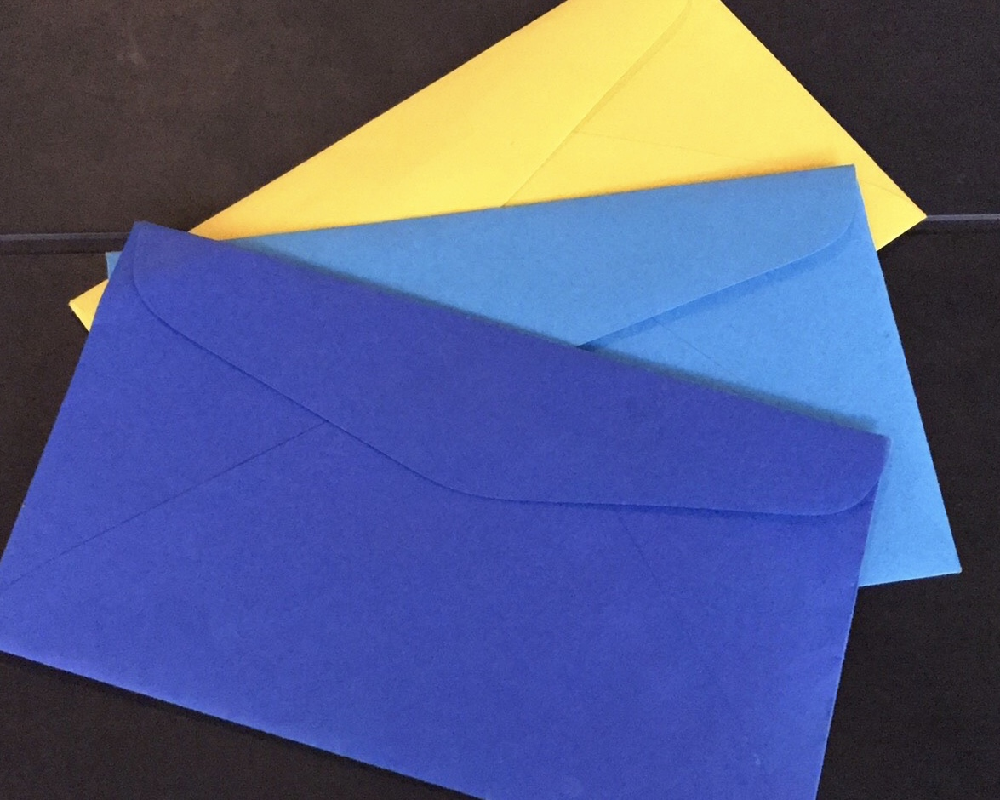

lang: es
publish: false
tags:
- planificación de las finanzas
- finanzas
- minimalismo
date: 2019-11-08 23:20:03.810321377 +00:00

---

# Mi solo-efectivo sistema de sobres

_For a long time I was very disorganized about my finances. I tried several apps and systems, but I wasn't able to stick to any of these, as I found all of them unnecessary complicated. So finally, I came up with my all system that's so easy even I am able to stick to it._

## Going cash-only

Never in my life I owned a credit card, believing it to be a horrible idea and a trap, despite being aware of its benefits. I of course own a debit card, but these days I use it only for online purchases (which I seldom do) and ... cash withdrawals.

I know the convenience of a debit card – or God forbid a credit card – you have all your money available (in case of a credit card, even money that's not even yours) at any moment, including when you're overwhelmed or your GF dumped you, which is a ~~great~~ terrible, terrible idea.

The point of having a budget is that you shouldn't be able to over to exceed it. If you can, then what's the point?

And here's my beef with debit cards: it's rather difficult to do that. Not without setting some automated transfer that'd send you only your weekly budget to your current balance, which I can't be bothered to do.

Therefore for my _regular expenses_, I decided to go cash-only.

## Regular expenses?

This is a crucial concept of this system: it's about usual day-to-day expenses: grocery shopping, mild luxuries (massage, therapy), anything that you do regularly enough and/or doesn't cost much.

I'm not suggesting you should use cash to buy a car for instance – I'm only talking about what I call regular expenses.

## Budgetting for week

Week is a perfect unit of time for keeping track of one's money.

Month is too long, so it's hard to know if you're spending too much or not and also have the annoying feature of having a different amount of days.

## The envelopes

### Dark blue envelope

Every Sunday evening I put my weekly budget in cash into the dark blue envelope. That's what I can afford to spend the coming week.

Apart from the cash I put inside an index card where I note how much I put in (the budget doesn't change from week to week, but just to be sure), how much money I take from the yellow envelope and on Sunday evening, I note how much has left.

### Yellow envelope

If there still is any money left on Sunday evening, I note how much it was on the index card and put them into the yellow envelope.

This money has been saved already, and therefore I use it when I need it: for expenses that are a bit higher to be covered from one week's budget and if the envelope starts to look fat, then to treat myself to whatever I fancy.

### Light blue envelope

Here I keep money for the coming weeks. I like to have have few weeks in advance, among other reasons, if I'd have issues with my card, I'd like to allow time to sort these out.

I also keep some fresh index cards here.

## Keeping the track

Every Sunday evening I do my financial house-keeping.

1. First, I count how much money has left. I note the sum onto the index card and I move the money into the yellow envelope.
2. I take a new index card from the light blue envelope. I note tomorrow's date and how much I'm putting it. I take the next week's budget from the light blue envelope and I put it alongside the index card into the dark blue envelope.
3. I note how much I actually spent into my digital system. The formula is: `initial sum - sum left - sum of what I took from the yellow envelope`.
4. I go into my bank statement and see whether I made any online purchases or whether there have been any automated purchases. I add all of these into my online system, so the sum really covers all that I spent the week.

This takes me no more than 10 minutes. What I like about this system is that it deals with all the day-to-day expenses as one thing.

I tried to use some apps in the past, but I didn't find them useful. Call me spoilt if you will, but spending 5 minutes to take a note of purchase of a chewing gum worth 50 cents is just not a productive use of my time.

At the same time: anything the goes out of the bank account directly, whether through a card transaction or a bank transfer is an exceptional purchase and I log it into my digital system as such (for these I don't log only the total, I also log what it was). That way it's really easy to see the big picture.
