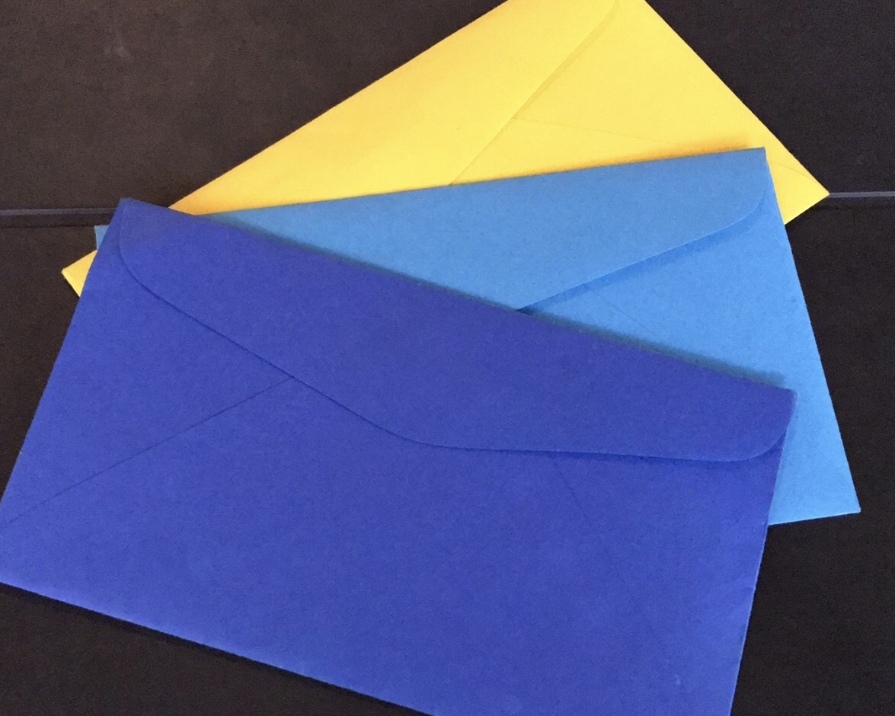

tags:
- finance planning
- finance
- minimalism
date: 2019-11-08 23:20:03.810321377 +00:00

---

# My cash-only envelope system

_For a long time I was very disorganized about my finances. I tried several apps and systems, but I wasn't able to stick to any of these, as I found all of them unnecessary complicated. So finally, I came up with my all system that's so easy even I am able to stick to it._

## Going cash-only

Never in my life I owned a credit card, believing it to be a horrible idea and a trap, despite being aware of its benefits. I of course own a debit card, but these days I use it only for online purchases (which I seldom do) and ... cash withdrawals.

I know the convenience of a debit card – or God forbid a credit card – you have all your money available (in case of a credit card, even money that's not even yours) at any moment, including when you're overwhelmed or your GF dumped you, which is a ~~great~~ terrible, terrible idea.

No solution to budgetting is more efficient than going cash only.

> You cannot spend what you don't have (on you).

## Budgetting for week

Week is a perfect unit of time for keeping track of one's money.

Month is too long, so it's hard to know if you're on target or not and also have the annoying feature of having a different amount of days.

This is for REGULAR EXPENSES
