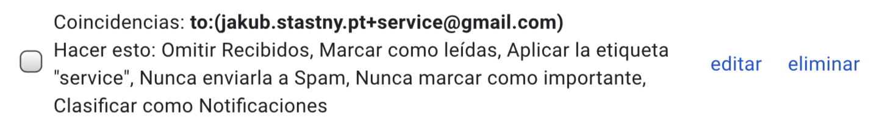

tags:
- Gmail
- email
date: 2019-11-25 20:20:04.177134521 +00:00

---

# Managing email with ease

_Email can be a giant pain in the arse. Some months ago I came up with a simple system for filtering email and it's been paying off._

First and foremost, it's important to filter personal email from mass email, such as notifications, newsletters and the like.

How? Gmail has this lovely feature that allows you to add `+anything` after your username and it will still get delivered to your inbox.

For instance if you're `joe@gmail.com`, you can also use `joe+newsletter@gmail.com`, `joe+notifications@gmail.com`, `joe+orders@gmail.com` and so on.

In my case, I give my default email (one without `+whatever`) only to people, not to machines.

So if I register for any app or online service, I'd always use `me+service@gmail.com`.

That means that all the notification emails will get delivered to `me+service@gmail.com` and ... I filter them.

[Gmail filters](https://mail.google.com/mail/u/0/#settings/filters)

