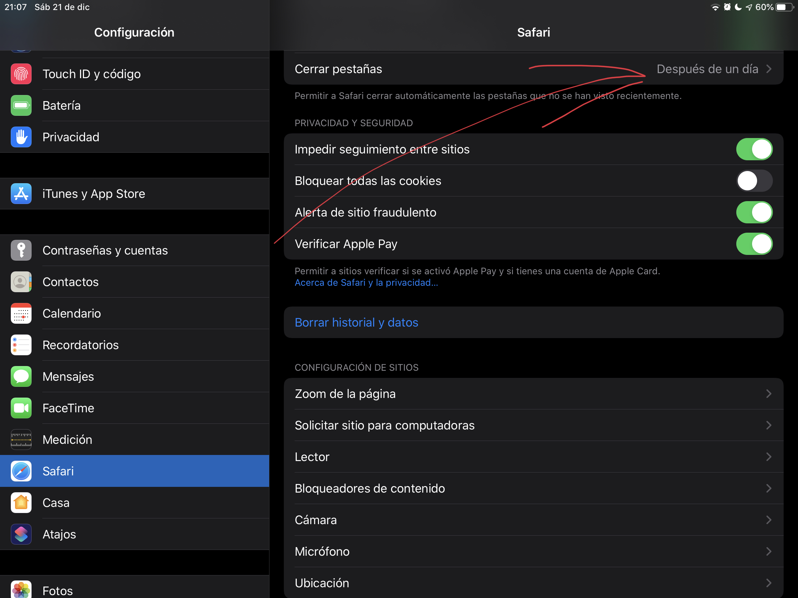

lang: es
tags:
- minimalism
date: 2019-12-22 03:40:05.869284924 +00:00

---

# Minimalismo digital

_It's hard to stay minimal digitally. Downloading an app or subscribing to a podcast is easy. And then there are all the updates, likes, mentions and ... where's your life gone?_

One thing is accumulating physical stuff. I have seldom struggled with that. I managed to move myself over the Atlantic in 2 round trips with just the luggage I was able to carry myself. I don't go to shops, don't shop online, not unless something is absolutely necessary.

But it's just so, so, so easy to register for that website. Download that app. Subscribe to that podcast. And so on.

But wait ... didn't you want to spend time with your kids? Do the work that matters to you? Spend more time with your wife? Read actual books?

Our ape brains were not build for the problem of having too much banana. If it feels good (aka we get our spike of dopamine), we want to consume it.

The zombie army forever and ever attached to their smartphones, as in by a magical power of some really bloody evil witch, that's to be seen everywhere where "civilization" arrived is a vivid proof of that.

Is there a way out?

# Uninstall

- Anything "social". These are the worst. The so called black hole of time. (Facebook, Twitter, Instagram.) And I'd strongly suggest: don't just uninstall, delete your profile now.
- Anything that's a subscription: RSS, podcasts etc.
- Anything with a recommendation engine. YouTube, TED etc. Watch it online if you want, I do, but I recommend against having the app installed.

# Settings

Find a way that open tabs get closed after 1 day. iPadOS has this built-in:

There are Chrome extensions to do the same, for instance TabWrangler.

# Read later

Whether you use Instapaper or Pocket, it's worth it. Yeah, you'll save a lot of crap into it, but it'll keep you free in the moment and then, once you get to read it, you'll realise that half of what you saved is crap and won't bother reading it.

# Worth keeping

Whatever app you use to read books.
