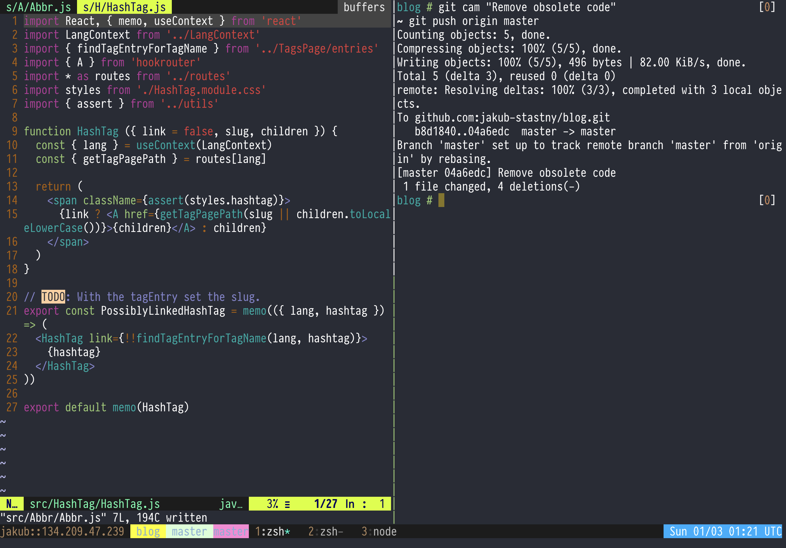
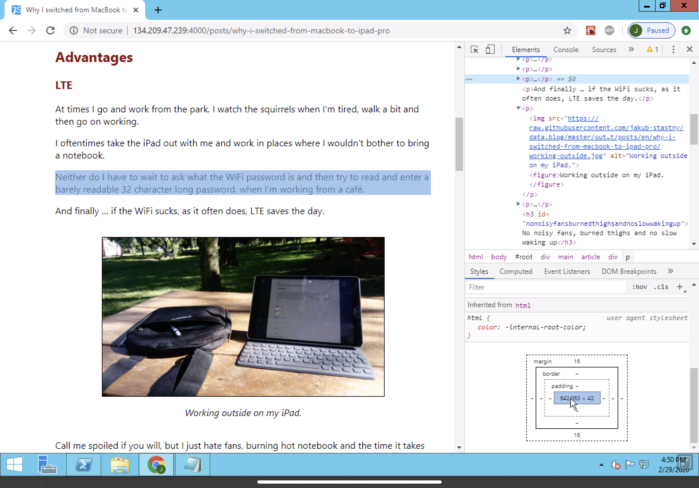
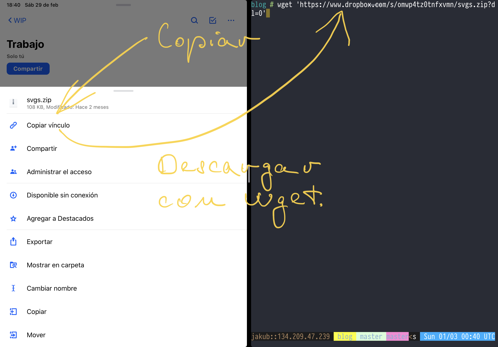
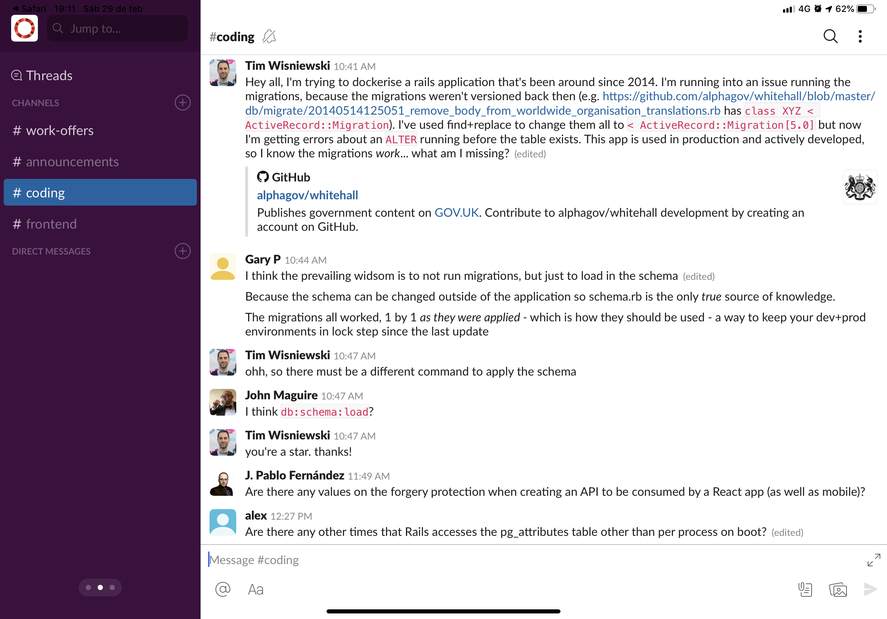

tags:
- iPad Pro
date: 2020-03-01T01:00:03+00:00

---

# Programming on iPad Pro

_My iPad Pro has been my main and only machine for nearly 2 years now. What was initially just an experiment turned into a totally viable and enjoyable experience. Today I'm sharing my specific workflows._

## Programming

While there are some tries to make a locally running shell for iOS[ˆ1], none of the solutions I've seen is anywhere close to being ready for real-world development.

That's no problem at all as I like to develop on a VPS anyway. It has many advantages:

- You can switch between (client) machines. Anything with an SSH client will do, regardless of the operation system.
- Putting iPad to sleep or even restarting it have no effects on code in the VPS – it just keeps running. If you have a large test suit, I'm sure you know what this means.
- You have your private staging. Just share an IP and port with your coworker and ask them whether the feature they asked you to make works as they wanted it.

## Mosh

Before you say _"yeah, but SSH is a pain in the arse"_, let me introduce you to Mosh. Mosh is a wrapper around SSH and it automatically reconnects if the connection drops or even if you change network.

It doesn't send over all the data, preventing flooding the connection, but only the data that are visible on the screen right now.

That means it's got no scroll buffer, but don't worry, just use tmux, `Ctrl+v [` will get you to the scroll mode.

Mosh is built into Blink.

## Testing web apps

As much as programming itself is really comfortable, testing web apps is still lagging.

Until recently there was no decent web inspector. Now there is [Inspect][inspect-app], which is by no means comparable to the Chrome web inspector, but it's a fair start.

Anyway if you're a professional web developer, you probably won't get by without a remote OS.

It might sound like it's defeating the purpose of having an iPad, but I'd disagree: you're still on a light device that's fun to use and getting virtual Windows is really cheap:

I use [CaVPS][cavps] and for $12.49 a month I have a VPS that's perfectly sufficient for my needs.

Now I'm not overly keen on Windows, but Windows support RDP, which is way better and more performant than VNC. And given that I only need Chrome and occasional edit to the hosts file, I don't really mind.

## Downloading files from the cloud

## Work-related communication

It's been a while since I used the Slack macOS client, but I like the iOS version much more.

When it comes to email, I really like [Spark][spark-app]. You can attach files from Dropbox and other cloud services, postpone messages and let them return to your inbox at scheduled time and so on. It's not bloated with extra features, but it supports all the features that are important for an advanced email client, such as adding aliases, control over which IMAP folders are visible on the main panel and so on.

## Bug trackers

Lately all the clients' projects I worked on used Jira, so I can only speak about this bug tracker.

The [Jira app][jira-app] is not bad. Jira always confuses me, whether it's the web version or the app, so it is what it is, but the app is fairly decent.

## Password management

I use 1Password for saving not just passwords, but also SSH keys and any confidential credential. It's the best thing out there in my opinion, especially as you don't have to pay mensuality: just sync it to your Dropbox.

I already wrote about it here: [My 1Password iOS workflow](/posts/my-1password-ios-workflow).

[ˆ1]: Such as [iSH](https://ish.app).
[inspect-app]: https://apps.apple.com/us/app/inspect-browser/id1203594958
[cavps]: https://www.cavpshost.com
[spark-app]: https://sparkmailapp.com
[jira-app]: https://apps.apple.com/us/app/jira-cloud-by-atlassian/id1006972087?l=es